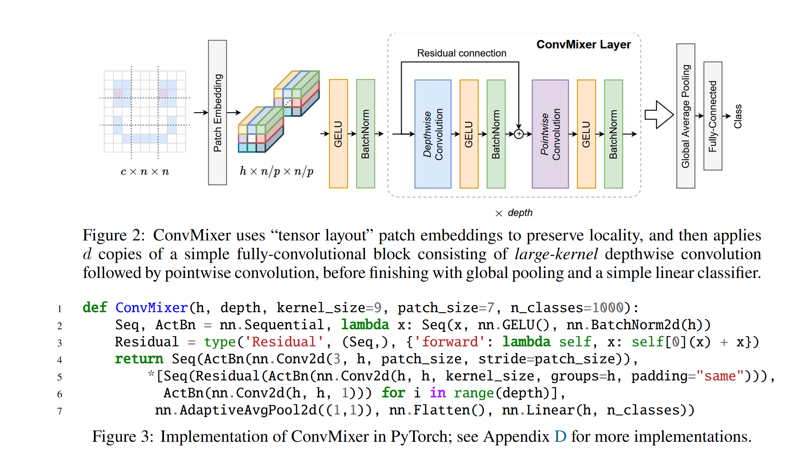

### ConvMixer主要观点
ViT的效果到底是transformer架构带来的还是patch带来的？

这篇文章的结论是：是patch带来的比较好的效果，卷积+patch也可以取得好效果

### ConvMixer架构

- PatchEmbedding不同于VIT的操作（直接画格子），这里也是通过卷积实现的，卷积核p*p,步长也是p
- 首先在depthwise-convolution将通道分成h组进行空间混合，然后再pointwise-convolution进行通道混合，整个ConvMixer Layer直观上就对应一个Transformer encoder
### ConvMixer特点
- ConvMixer只用卷积层，使用patch的形式 在计算过程中,patch特征大小不变，没有对特征做下采样（一般的卷积层特征都是越来越小）ConvMixer Layer 第一层到最后一层，序列长度不变
- 同时ConvMixer还把通道混合(pointwise-convolution)和空间混合(depthwise-convolution)分离开了 也就是说同时用这两个操作，既节省了计算量(少了一半)，也是相当于做了两种模型的混合

#### Notes
先通道混合再空间混合为何能减少计算量？

    conv_normal = nn.Conv2d(3, 3, 3, padding='same')
    conv_pointwise = nn.Conv2d(3, 3, 1, padding='same')
    conv_depthwise = nn.Conv2d(3, 3, 3, groups=3, padding='same')
    for i in conv_normal.parameters():
        print(torch.numel(i))
    for i in conv_pointwise.parameters():
        print(torch.numel(i))
    for i in conv_depthwise.parameters():
        print(torch.numel(i))

论文图中代码有待注释：`self[0](x)`等