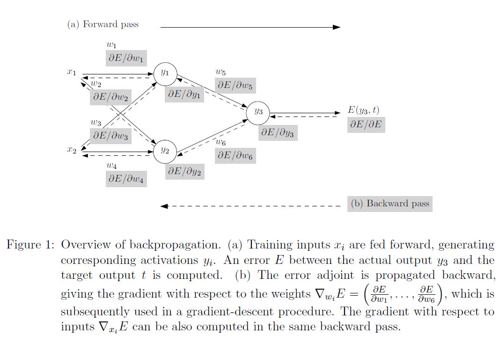
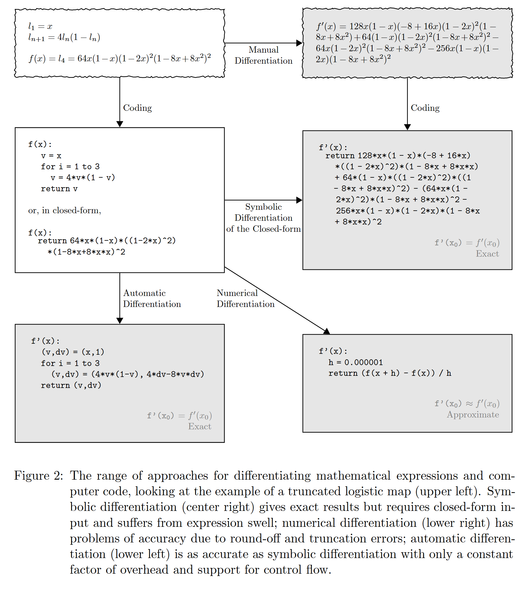
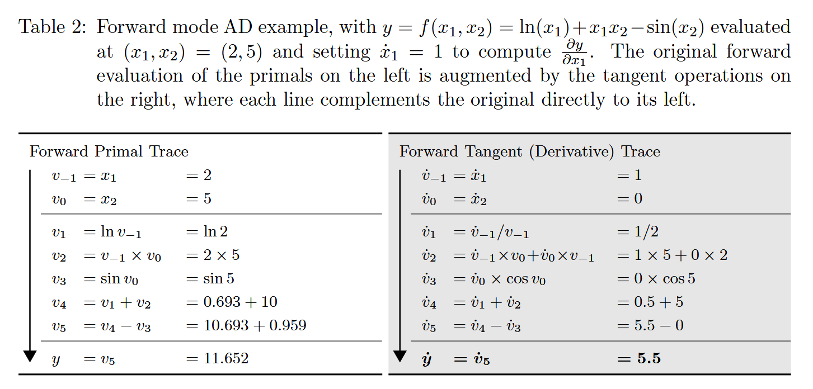
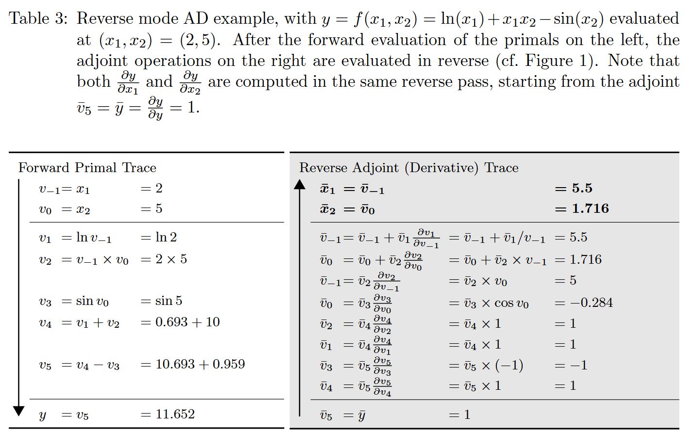
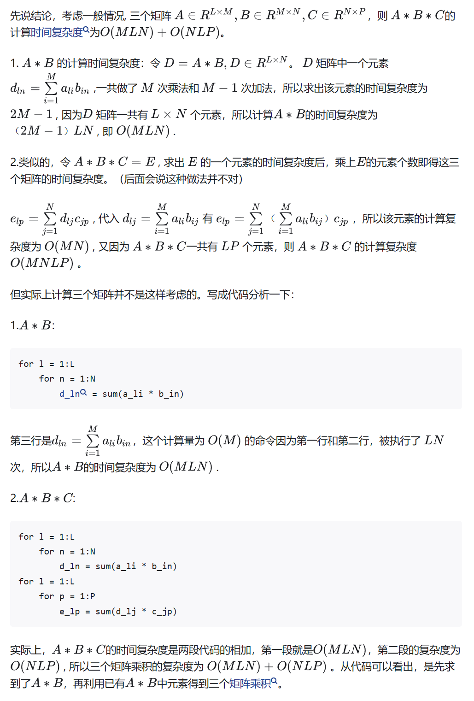

<h1>自动微分原理</h1>
<h2>Overview</h2>
前向计算+反向传播（即计算loss对所有参数的梯度，最终得到loss对于输入的梯度，这里是y3对于x1,x2的梯度）

<h2>几种不同的自动微分方法</h2>
- 手动微分
- 符号微分
- 数值近似微分
- 自动微分
  - 前向
  - 反向
  

<h2>Forward mode</h2>
计算每个参数对于输入的梯度，最终得到loss对多个输入的梯度（分多次，一次对一个）

<h3>dual numbers 方法</h3>
个人理解类似于泰勒展开一阶保留二阶变0
<h2>Reverse mode</h2>
- 如图，一次计算了对于多个x的梯度。
- 对于输出维度小于输入维度的大多数情况，计算复杂度更低（基于中间参数都是相同维度的假设）

<h2>注意</h2>
1. reverse mode 中梯度会累积，如图ad_fm中的v0一横，计算y对于v0的梯度时，由于经过两个中间节点，需要累加。这也是pytorch种需要zero_grad的原因。
2. 矩阵乘积计算的复杂度。
